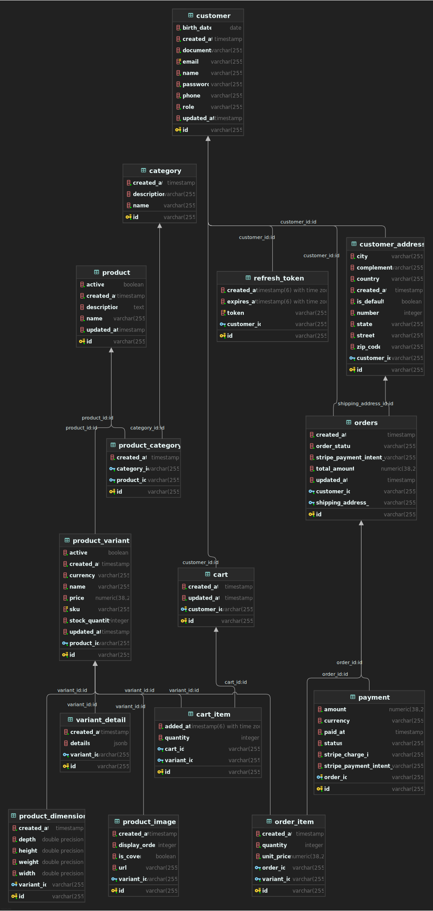

# 🛒 FastBuy — E-commerce API

A RESTful e-commerce API built with Spring Boot, featuring OAuth2 authentication with Google, JWT token management, Stripe payment integration, and a complete product catalog with variants.

---

## 📋 Table of Contents

- [About](#about)
- [Tech Stack](#tech-stack)
- [Architecture](#architecture)
- [Entity Diagram](#entity-diagram)
- [Getting Started](#getting-started)
- [Environment Variables](#environment-variables)
- [API Routes](#api-routes)
- [Running Tests](#running-tests)
- [Deploy](#deploy)

---

## About

FastBuy is a portfolio project developed to practice and demonstrate skills with the Spring ecosystem. It implements a complete e-commerce flow — from user registration and authentication to product catalog, shopping cart, and payment processing via Stripe.

---

## Tech Stack

| Layer | Technology |
|---|---|
| Language | Java 17 |
| Framework | Spring Boot 4.0.3 |
| Security | Spring Security + OAuth2 + JWT |
| Database (dev) | PostgreSQL via Docker |
| Database (prod) | Neon (PostgreSQL) |
| ORM | Spring Data JPA + Hibernate |
| Payment | Stripe |
| Image Storage | Cloudinary |
| Documentation | SpringDoc OpenAPI (Swagger) |
| Tests | JUnit 5 + Mockito |
| Build | Maven |
| Infra | Docker, Railway |

---

## Architecture

The project follows **Package by Feature** organization, grouping each domain's controllers, services and DTOs together:

```
fastbuy/
  auth/           → registration, login, OAuth2
  product/        → catalog, variants, images
  order/          → order management
  cart/           → shopping cart
  payment/        → Stripe integration
  user/           → user profile and addresses
  shared/         → entities, repositories, exceptions
  config/         → Spring configuration beans
  security/       → JWT, filters, OAuth2 handlers
```

---

## Entity Diagram


### Main Entities

- **User** — authenticated customer, supports OAuth2 (Google) and traditional login
- **Address** — multiple addresses per user
- **Cart / CartItem** — persistent shopping cart, created automatically on registration
- **Product / ProductVariant** — product with variants (SKU, price, stock, dimensions, dynamic attributes)
- **ProductImage** — cover image and gallery per variant
- **Order / OrderItem** — order with price snapshot at time of purchase
- **Payment** — Stripe payment record linked to order
- **RefreshToken** — stored refresh tokens for session management

---

## Getting Started

### Prerequisites

- Java 17+
- Docker and Docker Compose
- Maven

### 1. Clone the repository

```bash
git clone https://github.com/nathanyan/fastbuy.git
cd fastbuy
```

### 2. Configure environment variables

```bash
cp .env.example .env
```

Fill in the `.env` file with your local values (see [Environment Variables](#environment-variables)).

### 3. Start the database

```bash
docker-compose up -d
```

### 4. Run the application

```bash
./mvnw spring-boot:run
```

The API will be available at `http://localhost:8080`

Swagger UI: `http://localhost:8080/swagger-ui.html`

---

## Environment Variables

### `.env` (local / Docker)

```env
# Database
DB_NAME=ecommerce
DB_USER=postgres
DB_PASSWORD=postgres

# JWT
JWT_SECRET=your-base64-encoded-secret-at-least-32-chars

# Google OAuth2
GOOGLE_CLIENT_ID=
GOOGLE_CLIENT_SECRET=

# Stripe
STRIPE_SECRET_KEY=
STRIPE_WEBHOOK_SECRET=

# Cloudinary
CLOUDINARY_CLOUD_NAME=
CLOUDINARY_API_KEY=
CLOUDINARY_API_SECRET=
```

> To generate a Base64 JWT secret:
> ```bash
> echo -n "your-secret-with-at-least-32-characters" | base64
> ```

### Google OAuth2 Credentials

1. Access [Google Cloud Console](https://console.cloud.google.com)
2. Create a new project
3. Enable the **OAuth2 API**
4. Create credentials of type **OAuth 2.0 Client ID**
5. Add `http://localhost:8080/login/oauth2/code/google` as an authorized redirect URI

---

## API Routes

### Auth
| Method | Route | Description | Auth |
|---|---|---|---|
| POST | `/auth/register` | Register new user | Public |
| POST | `/auth/login` | Login with email and password | Public |
| POST | `/auth/refresh` | Refresh access token | Public |
| POST | `/auth/logout` | Invalidate refresh token | Required |
| GET | `/oauth2/authorization/google` | Login with Google | Public |

### Users
| Method | Route | Description | Auth |
|---|---|---|---|
| GET | `/users/me` | Get authenticated user profile | Required |
| PUT | `/users/me` | Update profile | Required |
| POST | `/users/me/addresses` | Add address | Required |

### Products
| Method | Route | Description | Auth |
|---|---|---|---|
| GET | `/products` | List products (paginated) | Public |
| GET | `/products/{id}` | Get product by ID | Public |
| POST | `/products` | Create product | Admin |
| PUT | `/products/{id}` | Update product | Admin |
| DELETE | `/products/{id}` | Deactivate product (soft delete) | Admin |

### Cart
| Method | Route | Description | Auth |
|---|---|---|---|
| GET | `/cart` | Get cart of authenticated user | Required |
| POST | `/cart/items` | Add item to cart | Required |
| PUT | `/cart/items/{id}` | Update item quantity | Required |
| DELETE | `/cart/items/{id}` | Remove item | Required |
| DELETE | `/cart` | Clear cart | Required |

### Orders
| Method | Route | Description | Auth |
|---|---|---|---|
| GET | `/orders` | List user orders | Required |
| GET | `/orders/{id}` | Get order by ID | Required |
| PATCH | `/orders/{id}/cancel` | Cancel order | Required |

### Payments
| Method | Route | Description | Auth |
|---|---|---|---|
| POST | `/payments/checkout` | Create PaymentIntent on Stripe | Required |
| POST | `/payments/webhook` | Receive Stripe events | Public* |

> *The webhook is public but validates the `Stripe-Signature` header.

---

## Payment Flow

```
1. POST /payments/checkout
2. Backend reads Cart and creates Order
3. Creates PaymentIntent on Stripe
4. Returns clientSecret to frontend
5. Frontend confirms payment directly with Stripe
6. Stripe sends Webhook event (payment_intent.succeeded)
7. Backend updates Order status to PAID
```

---

## Running Tests

```bash
# Run all tests
./mvnw test

# Run specific class
./mvnw test -Dtest=AuthServiceTest

# Generate coverage report
./mvnw verify
```

### Test structure

| Layer | Tool | Annotation |
|---|---|---|
| Service | JUnit 5 + Mockito | `@ExtendWith(MockitoExtension.class)` |
| Repository | JUnit 5 + H2 | `@DataJpaTest` |
| Controller | JUnit 5 + MockMvc | `@WebMvcTest` |

---

## Deploy

### Application → Railway

1. Connect your GitHub repository on [Railway](https://railway.app)
2. Add the environment variables in the service settings
3. Set `SPRING_PROFILES_ACTIVE=prod`

### Database → Neon

1. Create a free account at [Neon](https://neon.tech)
2. Create a new PostgreSQL project
3. Copy the connection string to the `DATABASE_URL` variable on Railway

### Images → Cloudinary

1. Create a free account at [Cloudinary](https://cloudinary.com)
2. Copy `Cloud Name`, `API Key` and `API Secret` to the environment variables

---

## Author

Developed by **Nathan Yan** — [GitHub](https://github.com/nathanyan) · [LinkedIn](https://linkedin.com/in/nathan-yan-alves)

---

> This project was developed for portfolio purposes to demonstrate practical knowledge of the Spring ecosystem, security, payment integrations and software engineering best practices.